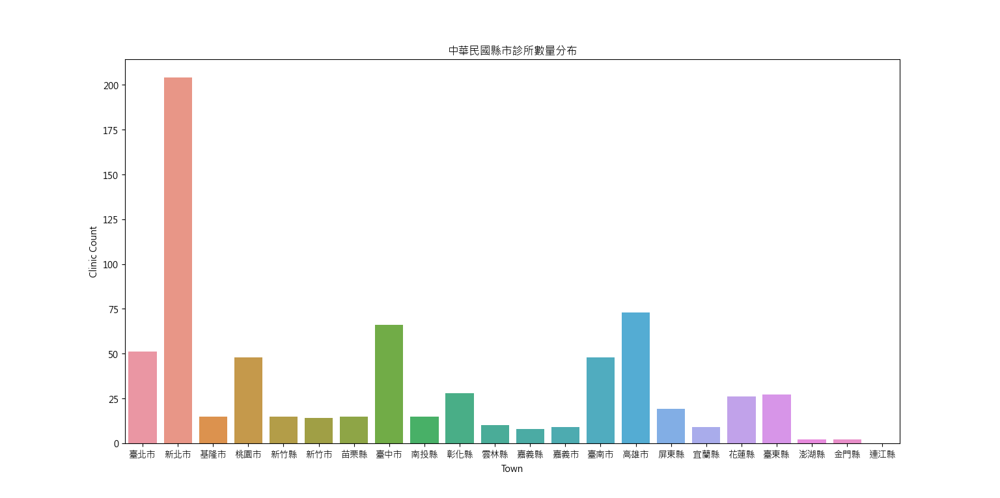

# 使用 Python 對配合辦理發放公費 COVID-19 家用快篩試劑社區定點診所名單做資料分析
# Python COVID19 Free Rapid Antigen Test Clinics

使用 Python 對「配合辦理發放公費COVID-19家用快篩試劑社區定點診所名單.csv」做資料分析。
Using Python analyze covid19-free-rapid-antigen-test-clinics.csv file.

> 2024/05/04 啟用維護，參見[日誌](#日誌)。

- #### 範例圖片
<div align = "center"></div>

- #### 範例影片
    - [使用 Python 分析公費 COVID-19 家用快篩試劑社區定點診所名單 講解片段（程式執行片段）](https://youtu.be/skPNc-oBZnw)
    - [使用 Python 分析公費 COVID-19 家用快篩試劑社區定點診所名單 講解片段（原理、初衷片段）](https://youtu.be/SmO1cgbHelw)

---

## 目錄
- [目錄](#目錄)
- [開發環境](#開發環境)
- [如何執行](#如何執行)
- [版本差異](#版本差異)
- [日誌](#日誌)
- [貢獻](#貢獻)
- [著作權](#著作權)

---

## 開發環境

- Windows Home 10 64bit
- VScode
- `Python 3.7.0`

---

## 如何執行

> 預設 ***Windows Home 10 64bit*** 作業系統  

步驟 一：可以些改 `analysis.py` 的內容再讀取 **.csv** ，或是直接[下載](https://drive.google.com/file/d/1CC22Vn0OIMu78SobwC43XpopH9mOqBNf/view?usp=sharing)我修改好的檔案，不在需要更改檔案。

- 方法一：直接點兩下執行 `analysis.py`

- 方法二： 

```bash
cd Python-covid19-free-rapid-antigen-test-clinics
```
```bash
python analysis.py
```
---

## 版本差異

| 版本 | 描述 |
| :--: | ---- |
| v1.0 | 現階段已完成。 |

---

## 日誌

| 時間 | 事件 |
| :--: | ---- |
| 2024/05/04 | 資料救援回復 **2022** 編輯紀錄，重新開始維護！ |

---

## 貢獻

獨立開發，這個專題就是在處理一些資料要手動打資料麻煩了一點，總體是很簡單的。

---

## 著作權

此專案受到 [GPL-3.0](https://www.gnu.org/licenses/gpl-3.0.zh-tw.html) 保障。  
Copyright © 2022-2024 zong zong ( zongzong0408 )
